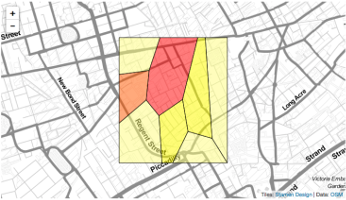

This demonstration uses data on cholera deaths collected in Soho by John Snow during the 1854 outbreak. First, load the package and the line list data and shapefiles. (Note that although the locations of deaths are Snow's, the sex and age of cases and the area populations have been simulated.)

```{r, message=FALSE}
library(mapData)
library(epimap)
data(snow_linelist)
data(snow_polygons)
```

The `cases` spatial points data frame stores line list-type data on individual cases with their locations:

```{r}
head(cases@data)
```

## Case counts at unique locations
Begin by calculating the number of cases at each unique location. The `density_data` function returns a data frame giving the number of cases at each location.

```{r}
locations <- density_data(cases)
head(locations)
nrow(cases@data)  
```
489 cases are included in total

```{r}
nrow(locations)   
```
... involving 250 unique locations.
	
## Allocating point cases to regions
It may be useful to allocate cases to geographical areas in which they occurred: countries, administrative regions, or in our case areas defined by the nearest public water supply. The `area_id` function uses a `SpatialPointsDataFrame` and a `SpatialPolygonsDataFrame` object to add a column to the points data frame giving the region for each case.

```{r}
cases <- area_id(cases, pump_areas, "name")
head(cases@data)
```

## Summaries by area
Now that we know to which "pump area" each case belongs, we can calculate summary statistics on the cases by area. For example, let's look at the mean age of cases in each area:

```{r}
agg_summaries(cases@data, var = "age", group = "name", FUN = mean)
```
	
In this example, as the ages were generated randomly from a uniform distribution, the means do not vary much!

## Prevalence by area
Now we will calculate the prevalence of infection within each area using the `calculate_prevalence` function. The function provides both point estimates and confidence intervals (adjustable, but set to 95% by default).

```{r}
cases@data <- merge(cases@data, pump_areas@data) # add the population sizes to the line list data
prev <- calculate_prevalence(cases@data, 
	pops=pump_areas@data[,c(1,3)], 
	region.head="pump.id",
	conf.level=0.95)
print(prev)
```

The calculated prevalence can be included as information about each pump area, and plotted on a map using the `epimap` package.

```{r, fig.show='hold'}
pump_areas@data <- merge(
	pump_areas@data, 
	data.frame(pump.id = prev$region, prev = prev$prevalence)
	)
		
choroMap(pump_areas, col.by="prev", directView="disabled", alpha=0.5)

# In fact, the figure below was made by running 
# choroMap(pump_areas, col.by="prev", directView="browser", alpha=0.5),
# which brings up the figure in a browser window.
```

<div style="width:300px; height=200px">

</div>

## Unusually high or low prevalence
From the map, the area surrounding the Broad Street pump seems to have a higher prevalence than areas near other pumps. But was it "unusually" high, or just the result of random local variation?

```{r}
	unusual_prevalence_region(cases@data, pump_areas@data[2:3], region.head="name", region.i="Broad Street")
```

The small p-value strongly suggests something different about this area. We can do the same for every region using a single command as follows:

```{r}
	calculate_prevalence_unusual_pval(cases@data, pump_areas@data[2:3], region.head="name")
```

Here we see that there are only two regions which are _not_ found to have unusually high or low prevalence, as judged by their large p-vales: Briddle Street and South Soho. Based on p-values, Broad Street and Crown Chapel might be classified as having high prevalence (+1 appears in the "sign" column of the output) while Coventry Street, Dean Street, Great Malborough Street and Warwick would all be classed as having unusually low prevalence compared to the area as a whole (-1 in the "sign" column).